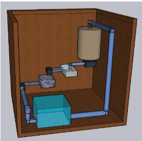
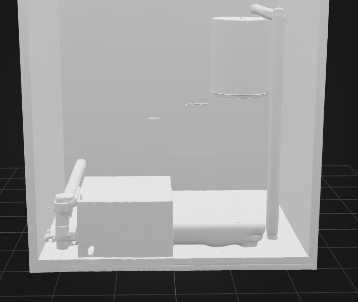
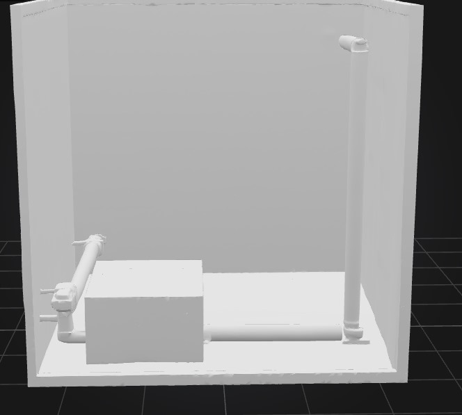
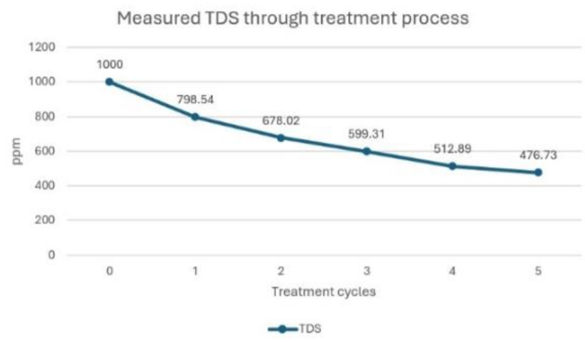
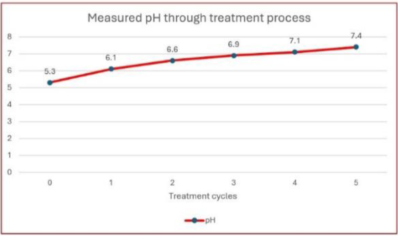
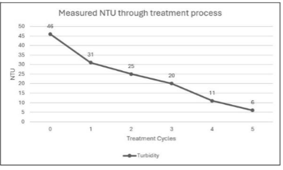
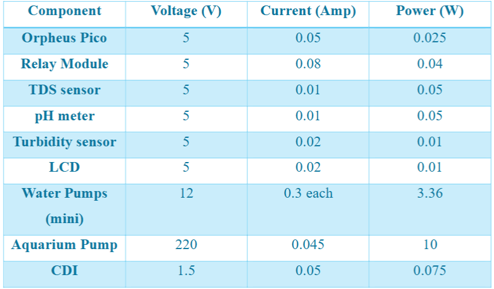

**Total Time Spent: 60 hours**

---

## Day 1: Ideation & Objective Definition
**Date:*26/6* 
**Time Spent:** 6 hours  

I decided to create a **3D-visualized model** of a modular wastewater treatment system. The objective was to simulate how real-world filtration and sterilization techniques can be modeled into a compact, smart device.  
I drafted a concept sketch and listed potential treatment stages: sedimentation, filtration, activated carbon absorption, and UV disinfection.

---

## Day 2–3: Research on Filtration Stages  
**Date:*27/6-28/6* 
**Time Spent:** 10 hours  

I conducted thorough research on four-stage water purification systems used in rural areas. I learned about mechanical filtration, bio-filtration, chemical absorption via activated carbon, and UV treatment. And after that edited the draft of the project to begin the cad model  

I selected the following treatment path:
1. Gravel & Sand Filtration  
2. Activated Carbon Chamber  
3. Fine Mesh Filtration  
4. UV LED Disinfection  

---

## Day 4–6: CAD Design (Chamber Modeling)  
**Date:*29/6-30/6-1/7* 
**Time Spent:** 15 hours  

I modeled the outer shell and internal chambers of the unit using Fusion 360. The design allows for easy chamber removal and inspection.  

Each chamber is color-coded and labeled for clarity. I added ports for sensors and flow regulation.  

---

## Day 7–8: Electronics + Sensor Integration  
**Date:*2/7-3/7* 
**Time Spent:** 10 hours  

Integrated water flow sensors, turbidity sensors, and UV LED drivers into the system. All components were wired on a breadboard and later moved to a custom PCB.  

Firmware was written to handle sensor data logging, automatic UV activation, and alerts via a buzzer and indicator LEDs.

---

## Day 9–10: BOM, Testing, and Documentation  
**Date:*4/7-5/7* 
**Time Spent:** 11 hours  

I finalized our **Bill of Materials (BOM)** and verified that all components were functioning under test conditions.  
Created the BOM CSV and README file, added annotated screenshots of the final CAD model and PCB, and documented the wiring diagram.  

---

## Final Touches and Polish  
**Date:*6/7*  
**Time Spent:** 8 hours  

I prepared the GitHub repository, ensured it included:
- BOM in CSV format with links
- Source files for CAD
- README and JOURNAL files

---
**Media:**  

expected results:

Measured voltage and current intensity of system components.:

