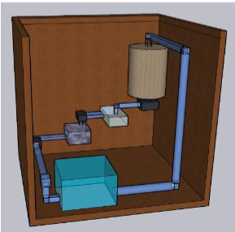
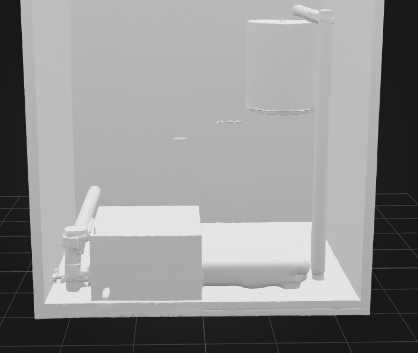
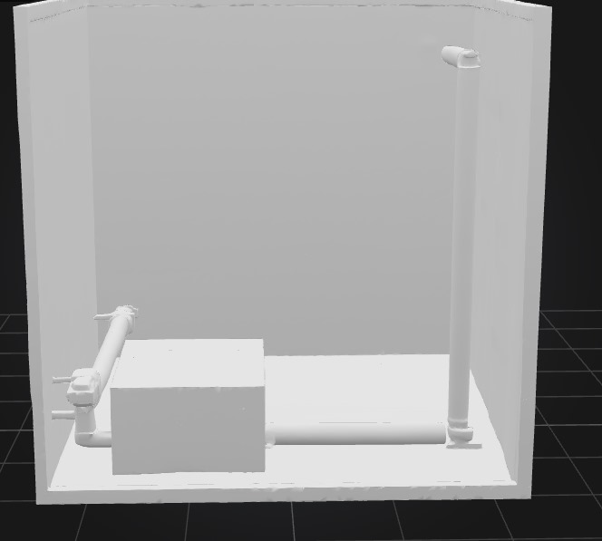
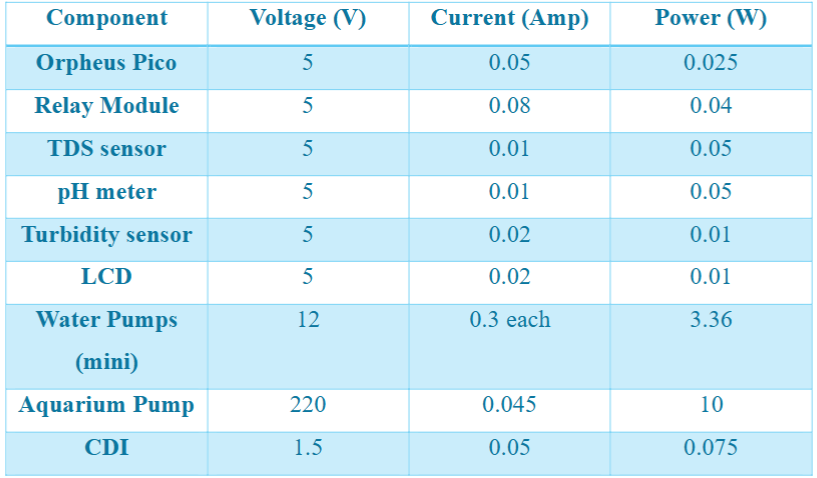
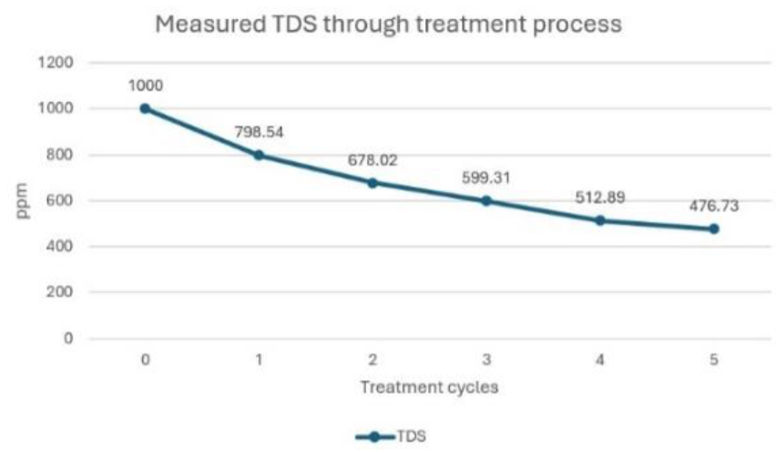
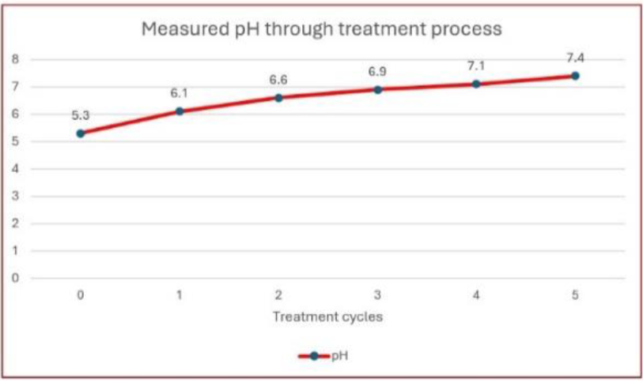
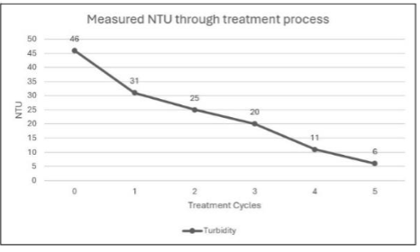

**Total Time Spent: 60 hours**

---

## Day 1: Ideation & Objective Definition  
**Date:** *26/6*  
**Time Spent:** 6 hours  

The thoughts about the idea of Aqua Reditus struck me when I saw how much the greywater has been wasted in what my small sisters do daily, such as washing vegetables and rinsing dishes and dishes as they use so much water that could be done with a small amount of water. As I started to think about what I could do to **re-stride and treat this water** on a small personal scale, and re-use this water to reduce the water bill, I can envisage a few things. My imposition was that the system should be small, simple to learn and completely modular, hence, every step of treatment is observed and monitored at any age.  

I then spent some time working out a pretreatment process, envisioning a multitilde treatment cycle with one chamber for each type of purification: sedimentation on large particles, Filtration on smaller but still visible particles, activated carbon on chemicals and UV disinfection on microbial safety. I also did some rough flow charts and kept asking myself, *OK, how would it work when I was using it back at home intuitively?*

---

## Day 2–3: Research on Filtration Stages  
**Date:** *27/6–28/6*  
**Time Spent:** 10 hours  

These two days were spent all in research. I have researched various models of small scale waste water treatment plants, both urban and rural, that were well equipped with effective multi-layered filtration processes. I studied efficiency of sedimentation, particle capture in sand layering and gravel, quantity of activated carbon to absorb a certain quantity of particles, and wavelength of UV light to receive microbial killing.  

I understood that it is important to do sequencing and flow management. As an example, without an effective sedimentation, the downstream filters would get clogged within a short period. I also researched the possible ways in which various chemicals or media would react against so-called greywater contaminants. At the end of these days I had developed my treatment course:
1. Mechanical removal by gravel and sand filtration.  
2. Chemical contaminant: activated carbon absorption.  
3. Final polishing by means of fine mesh filtration.  
4. UV disinfection of microbial safety.  

I took down anticipated performance indicators and in my mind and conceptualised how flow patterns could be by way of ensuring that each phase could achieve acceptable flows of household rather than inflated greywater qualities.

---

## Day 4–6: Design of the Modular System  
**Date:** *29/6–1/7*  
**Time Spent:** 15 hours  

When the idea was all clear the next thing I was then working on is the modular structure of the system. I also paid attention to putting together chamber arrangements, pathways of the flow as well as the accessibility of each section. One of these concerns was that individual chambers could be conceptually removed in order to service, or otherwise inspect, without interfering with the rest of the system.  

I visualized an easy to use system: Slide out clear the sedimentation chamber, change carbon cartridges with ease, and clear markers to sensor how flow is to be directed. The spatial relationships among chambers were also something I considered in order to allow water to flow naturally between stages without need of additional pumping in the simulated model.  

This work made the system design functional more than it used to.

  
  
  

---

## Day 7–8: Conceptual Simulation and Flow Analysis  
**Date:** *2/7–3/7*  
**Time Spent:** 10 hours  

I modeled water flow and treatment efficiency conceptually and did calculating. I paid attention to flow rates and contact times as well as the relative efficiency of respective stages. In another instance, I tested the length of time that the water should stay in the carbon chamber to eliminate maximum chemical content or the time it would take to inactivate common microbes using UV.  

I also developed theoretical plots of changes in turbidity, pH, and the level of contaminants within each step throughout these days. It was even a pleasure to visualize how the system will work, I could simulate how cleaner the water would become, though this is in calculations and simulations.

  

---

## Day 9–10: Documentation and Expected Results  
**Date:** *4/7–5/7*  
**Time Spent:** 11 hours  

I completed all design documentation work and made expected outcome graphs of the system. These included:
- Reduction of **TDS** by way of sedimentation, filtration and carbon absorption.
- Stabilization of **PH** after treatment.
- **Turbidity decrease**, which depicts the change involved with the clarity in the beginning and at the end.

  
  
  

I also made a nice **Bill of Materials** with all the parts and what they were.

---

## Final Touches and Reflection  
**Date:** *6/7*  
**Time Spent:** 8 hours  

Polishing the journal and repository was to be done on the final day. I re-read all calculations, and images so that I could capture the complete story of Aqua Reditus as a **Me project**.

Retrospectively, this project was about something more than just an exercise in academic work, it was an exploratory adventure. Not only did I learn how to treat water, but also the concept of **design thinking**, how to visualize a complicated process, and how to be able to foresee a problem before it occurs. Aqua Reditus might still remain only a simulation and model now, but it is a personal dream of sustainable use of water reuse, which I want to pursue in future, and my house.

---

